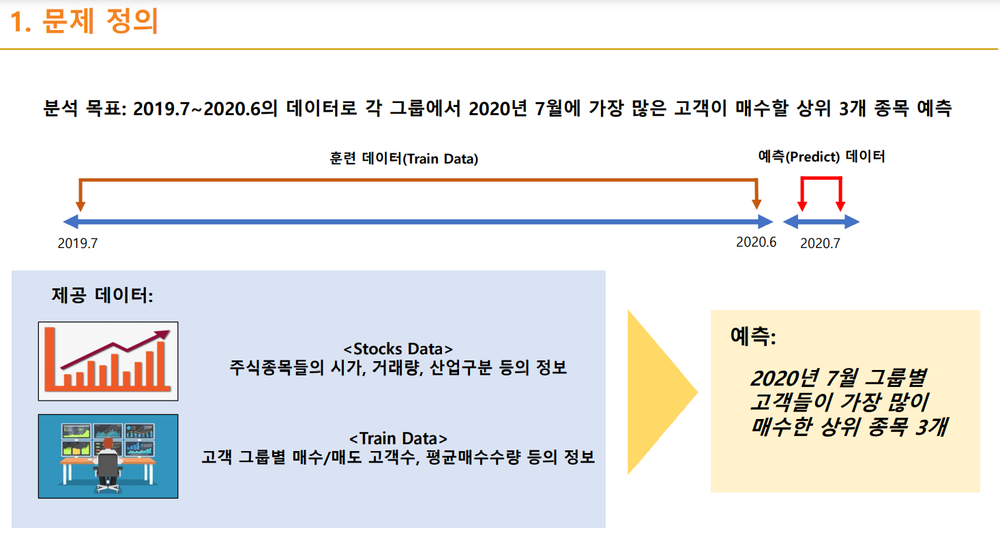
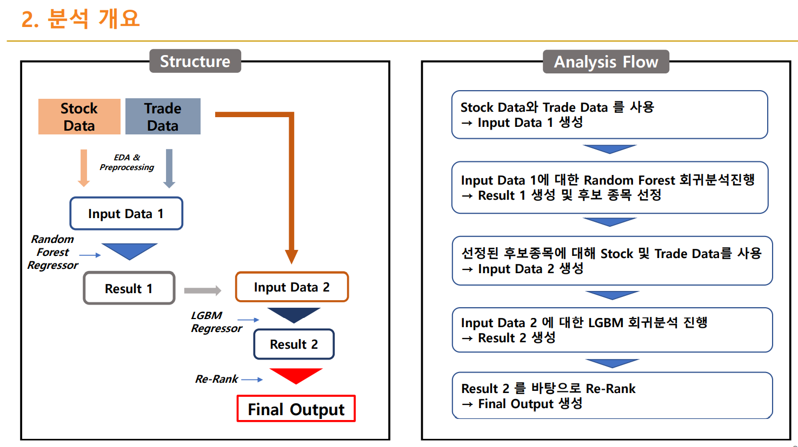

# 2020 금융 빅데이터 페스티발

## 주식거래내역으로 매수 상위종목 예측 부문

##### - 팀 이름 : 데이터를좀아는개미들 (이경환, 변영목, 양명한)

##### - 진행 방식: 예선(8/28~10/4  | 공개 리더보드 상 5위) => 본선(~10/30 | 상위 7팀 안에 포함) => 결선(11/26 진행 예정 | 상위 3팀 안에 포함)

##### - 주요 사용 패키지

- lightgbm
- numpy
- pandas
- scikit-learn

